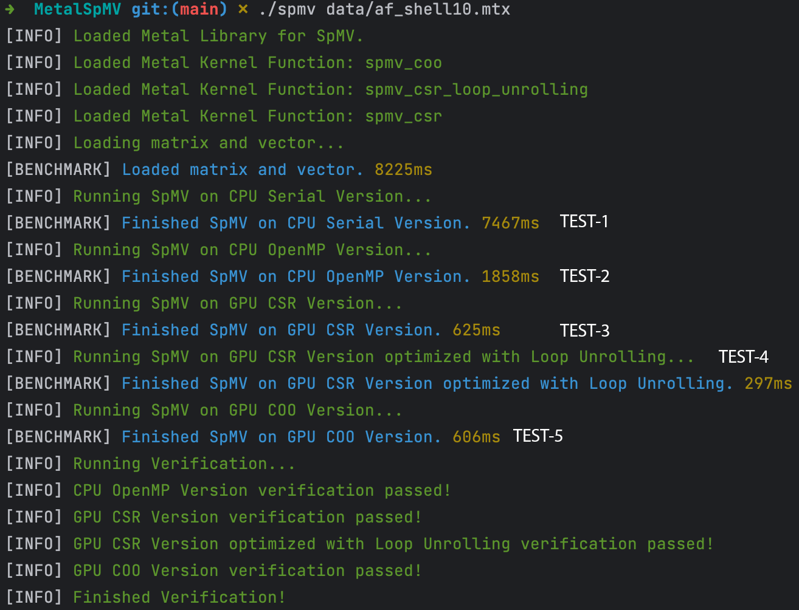
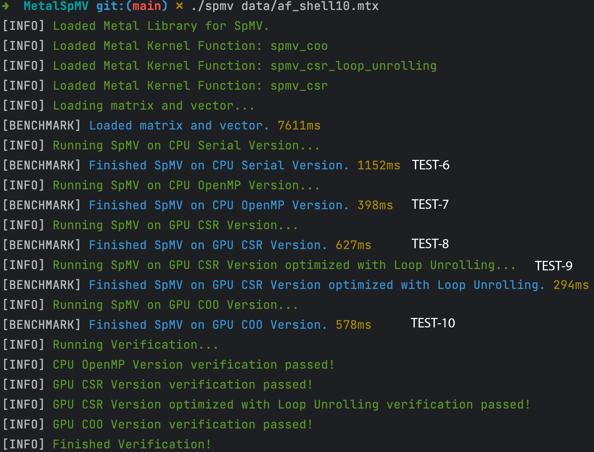

# SpMV Calculation using GPU(Apple Metal) and CPU(OpenMP)

## Introduction
This project implements a Sparse Matrix-Vector Multiplication (SpMV) calculator using CSR and COO formats and optimizations on both CPU and GPU. The program loads a sparse matrix and a vector from a file, and calculates the matrix-vector product.
- The GPU part is implemented using **Apple Metal Shading Language**
- The CPU part is implemented using **OpenMP**

## Hardware Requirement

This program can only run on **Apple Chip Laptop**, such as M1, M1 Pro, M1 Max, M2, M2 Pro, M2 Max.

## Environment Setup

```bash
# Install llvm version of clang to support OpenMP
brew install llvm
# Install OpenMP
brew install libomp
# Install GSL
brew install gsl
# Install cmake
brew install cmake
# Install XCode Command Line Tools to support Metal Compiler
xcode-select --install
```

## Runnning Command

The program **error tips are very friendly**, so you can just run the program and see the tips.

```bash
cmake .
make && make kernel
./spmv xxx.mtx
```

## File Structure

- ### spmv.metal

  This is the Metal kernel using Metal Shading Language. It provides three kernel functions to perform Sparse Matrix-Vector Multiplication (SpMV) using different formats and optimizations on GPU. 

  - spmv_csr

    This kernel function calculates the SpMV product using the CSR format. It takes in row pointers, column indices, values, input vector `x`, and an output vector `result`. The kernel processes each row of the sparse matrix in parallel.

  - spmv_coo

    Optimization 1 for `spmv_csr`. This kernel function calculates the SpMV product using the COO format. It processes the non-zero elements of the sparse matrix in parallel. It takes row indices, column indices, values, input vector `x`, and an output vector `result` (**with atomic float type**).

  - spmv_csr_loop_unrolling

    Optimization 2 for `spmv_csr`. This kernel function applies loop unrolling optimization. The loop unrolling is performed with a step of 4 to potentially improve performance. 

- ### spmv_calculator.h / spmv_calculator.cpp

  The **SpmvCalculator** is responsible for performing SpMV calculations using different approaches:

  - GPU with CSR format
  - GPU with CSR format and loop unrolling optimization
  - GPU with COO format
  - CPU with serial processing
  - CPU with OpenMP parallel processing

  It also provides a method for verifying the results.

- ### logger.h / logger.cpp

  The **Logger** provides static methods for logging messages of various levels: `info`, `error`, `debug`, and `warn`. It also includes a method, `time`, for measuring and logging the time taken by specific operations.

## Research and Design

- The Apple GPU with Metal Shading Language (MSL) can run up to **1024** threads. Technically, it can achieve a **1000x** speedup, confirmed by running all the computations inside a single kernel; the code logic was omitted.
- GPU MSL kernel optimization is not as efficient as CPU optimization, such as shading overhead and kernel compiler optimization. As a result, it experiences performance loss.
- The basic algorithm uses CSR and assigns each row to a thread, which then serially loops through the non-zero values in the row to compute the final results.
- Optimization 1: Employ COO format instead of CSR, distributing all non-zero values to each GPU thread and atomically summing the results. While this algorithm should outperform the CSR format, atomic reduction overhead and memory cache issues prevent significant improvement.
- Optimization 2: Since Metal GPU compiler optimization is less mature than C++, loop unrolling can lead to significant speedup due to SIMD optimization.

## Performance

**Conclusion**:

- CPU OpenMP with 4 threads achieves a **4x** speedup compared to the CPU Serial Version (***TEST-1*** vs ***TEST-2***, ***TEST-6*** vs ***TEST-7***).

- GPU COO runs **slightly faster** than GPU CSR (***TEST-3*** vs ***TEST-5***, ***TEST-8*** vs ***TEST-10***).

- GPU CSR with loop unrolling optimization achieves a **2x** speedup (***TEST-3*** vs ***TEST-4***, ***TEST-8*** vs ***TEST-9***).

- CPU Serial and OpenMP versions attain a **6x** speedup with `-O3` compiler optimization (***TEST-1*** vs ***TEST-6***, ***TEST-2*** vs ***TEST-7***).

- GPU CSR provides a **25x** speedup compared to the CPU Serial without compiler optimization and a **4x** speedup compared to CPU Serial with `-O3` optimization (***TEST-1*** vs ***TEST-4***, ***TEST-6*** vs ***TEST-9***).

- Comparing the best versions, the GPU still runs faster than the CPU (***TEST-7*** vs ***TEST-9***).

**Running Results**:

- Results Table

| CPU Compiler Optimization | Test Number | Test Item                           | Time (ms) |
| ------------------------- | ----------- | ----------------------------------- | --------- |
| `-O0`                     | 1           | CPU Serial Version                  | 7467      |
| `-O0`                     | 2           | CPU OpenMP Version                  | 1858      |
| `-O0`                     | 3           | GPU CSR Version                     | 625       |
| `-O0`                     | 4           | GPU CSR with Loop Unrolling Version | 297       |
| `-O0`                     | 5           | CPU COO Version                     | 606       |
| `-O3`                     | 6           | CPU Serial Version                  | 1152      |
| `-O3`                     | 7           | CPU OpenMP Version                  | 398       |
| `-O3`                     | 8           | GPU CSR Version                     | 627       |
| `-O3`                     | 9           | GPU CSR with Loop Unrolling Version | 294       |
| `-O3`                     | 10          | CPU COO Version                     | 578       |

- CPU applies `-O0`



- C++ applies `-O3`




## Available Matrix Collection
[nlpkkt80](https://suitesparse-collection-website.herokuapp.com/RB/Schenk/nlpkkt80.tar.gz)

[af_shell10](https://suitesparse-collection-website.herokuapp.com/MM/Schenk_AFE/af_shell10.tar.gz)

[StocF-1465](https://suitesparse-collection-website.herokuapp.com/MM/Janna/StocF-1465.tar.gz)
