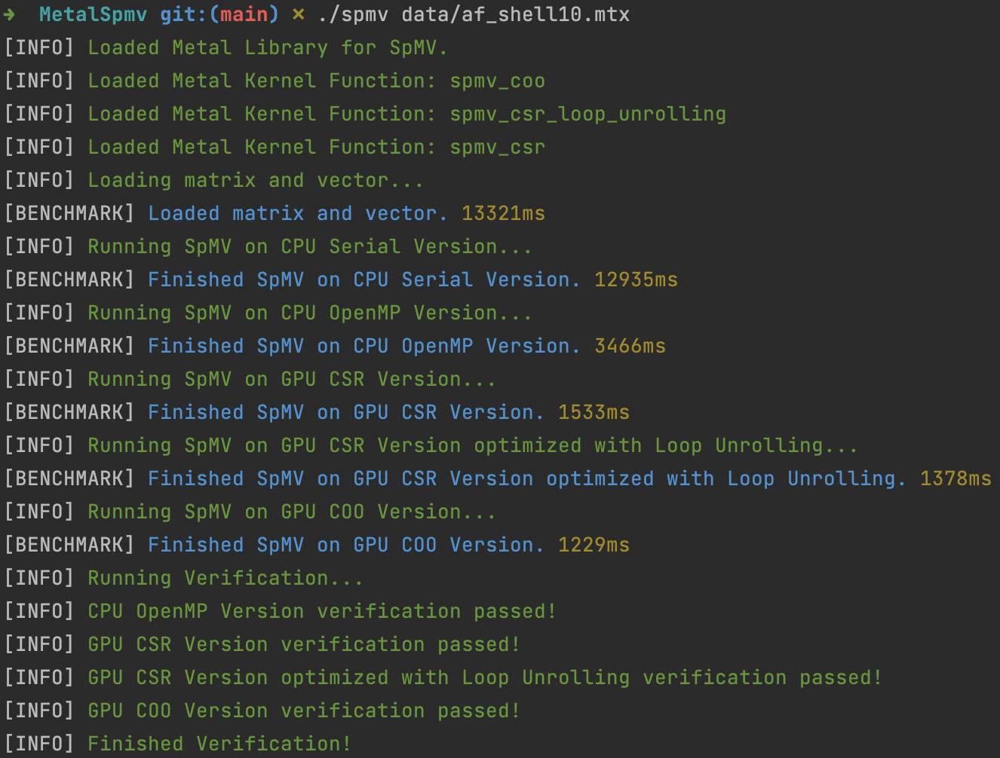
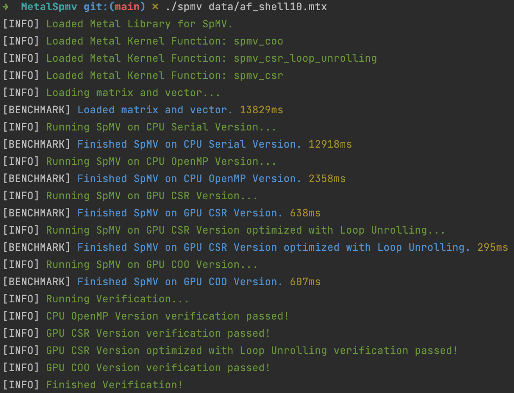
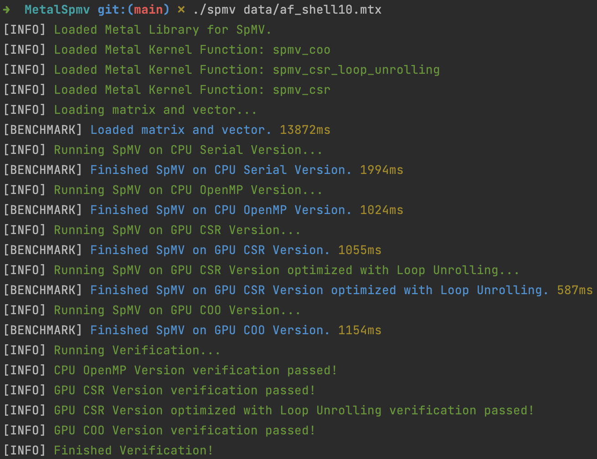

# SpMV Calculation using GPU(Apple Metal) and CPU(OpenMP)

## Introduction
This project implements a Sparse Matrix-Vector Multiplication (SpMV) calculator using CSR and COO formats and optimizations on both CPU and GPU. The program loads a sparse matrix and a vector from a file, and calculates the matrix-vector product.
- The GPU part is implemented using **Apple Metal Shading Language**
- The CPU part is implemented using **OpenMP**

## Hardware Requirement

This program can only run on **Apple Chip Laptop**, such as M1, M1 Pro, M1 Max, M2, M2 Pro, M2 Max.

## Environment Setup

```bash
# Install llvm version of clang to support OpenMP
brew install llvm
# Install OpenMP
brew install libomp
# Install GSL
brew install gsl
# Install cmake
brew install cmake
# Install XCode Command Line Tools to support Metal Compiler
xcode-select --install
```

## File Structure

- ### spmv.metal

  This is the Metal kernel using Metal Shading Language. It provides three kernel functions to perform Sparse Matrix-Vector Multiplication (SpMV) using different formats and optimizations on GPU. 

  - spmv_csr

    This kernel function calculates the SpMV product using the CSR format. It takes in row pointers, column indices, values, input vector `x`, and an output vector `result`. The kernel processes each row of the sparse matrix in parallel.

  - spmv_csr_loop_unrolling

    This kernel function is based on `spmv_csr`. It applies loop unrolling optimization. The loop unrolling is performed with a step of 4 to potentially improve performance. 

  - spmv_coo

    This kernel function calculates the SpMV product using the COO format. It processes the non-zero elements of the sparse matrix in parallel. It takes row indices, column indices, values, input vector `x`, and an output vector `result` (**with atomic float type**).

- ### spmv_calculator.h / spmv_calculator.cpp

  The **SpmvCalculator** is responsible for performing SpMV calculations using different approaches:

  - GPU with CSR format
  - GPU with CSR format and loop unrolling optimization
  - GPU with COO format
  - CPU with serial processing
  - CPU with OpenMP parallel processing

  It also provides a method for verifying the results.

- ### logger.h / logger.cpp

  The **Logger** provides static methods for logging messages of various levels: `info`, `error`, `debug`, and `warn`. It also includes a method, `time`, for measuring and logging the time taken by specific operations.

## Runnning Command

The program **error tips are very friendly**, so you can just run the program and see the tips.

```bash
cmake .
make && make kernel
./spmv xxx.mtx
```

## Performance
**Conclusion**:

- Without any compiler optimization, the GPU program achieves a **10x** speedup in comparison to the CPU serial version.
- Utilizing loop unrolling optimization and `-O2`, the GPU program attains a **40x** speedup compared to the CPU serial version.
- When the CPU applies the `-O3` optimization, the CPU program experiences a **6.5x** speedup, thereby narrowing the performance gap between the GPU and CPU.

**Running Results**:

- C++ applies `-O0` && MSL applies `-O0`



- C++ applies `-O0`  && MSL applies `-O2`



- C++ applies `-O3` and MSL applies `-O2`




## Available Matrix Collection
[nlpkkt80](https://suitesparse-collection-website.herokuapp.com/RB/Schenk/nlpkkt80.tar.gz)

[af_shell10](https://suitesparse-collection-website.herokuapp.com/MM/Schenk_AFE/af_shell10.tar.gz)

[StocF-1465](https://suitesparse-collection-website.herokuapp.com/MM/Janna/StocF-1465.tar.gz)